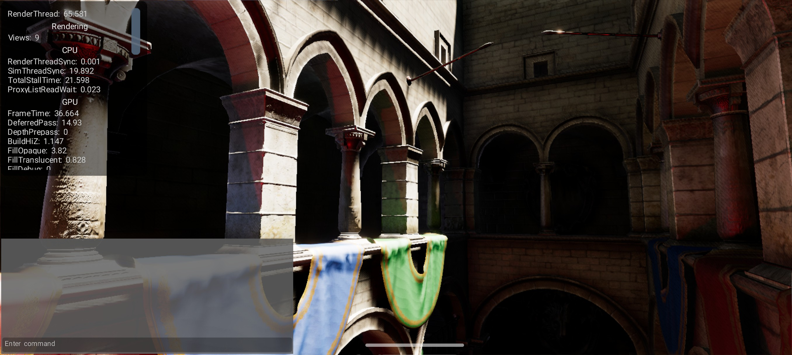
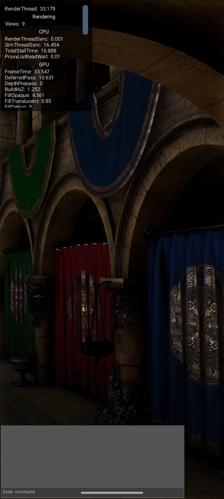
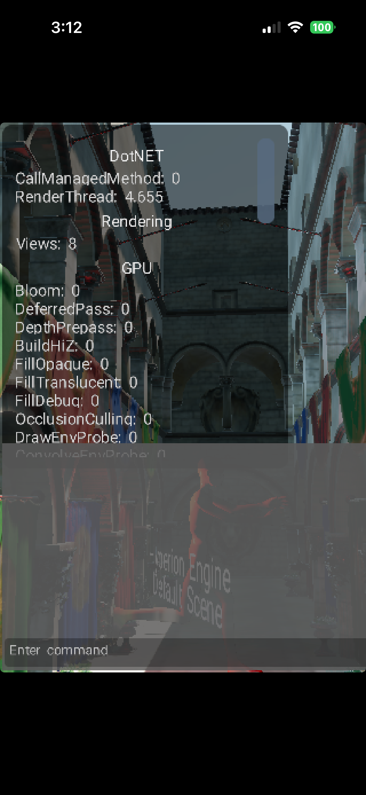

###### (This isn't a post about toasters. But the analogy will do)

What's all of this _custom game engine development_ work for, if not to be able to run the same Sponza test scene I've been using for the last ten (10?!?!?) years on every possible device I can properly get my hands on?

Seeing as getting access to a Switch 1/2 or PS dev kit is currently proving to be a difficult task (for my own personal usage, at least), I've decided to make the ultimate sacrifice - port Hyperion to mobile. What must I sacrifice, you ask? My sanity.

----

In my day-to-day, I've encountered some strange driver-specific issues and nuances on Android devices. With that, I wanted to see how broken my own engine, Hyperion, would be if I ported it to Android, fully bracing for chaos.

Starting with Android: getting the boilerplate set up for event handling, window / Vulkan surface creation etc... wasn't bad. What _was_ a bit annoying though, was reworking the engine's asset registry system from using traditional C standard library functions like `fread`, or POSIX `mmap` / Win32 `MapViewOfFile` to working with Android's AssetManager.

Once that was out of the way, I was able to load my precompiled shaders, meshes and textures. The main thing I encountered was a much larger number of swapchain images were returned - a total of 8, whereas I'm typically working with 3 on PC. No big deal - I've surely handled this properly in my Vulkan backend, right?

> Narrator: He did not.

You see, when you are presenting frames in Vulkan, you need two sets of semaphores - used for ensuring images are acquired and presented in the correct order. Without these, images would appear out of order and most likely would become completely corrupt. Not a fun experience.

The first set of semaphores, we'll call the _image available_ semaphores (one per image, in my case here, 8), and the second, _present_ semaphores (one per _frame in flight_).
> Having some number of frames in _flight_ means that GPU-accessed data used for drawing the frame is buffered - we can write commands for the GPU to use during frame 1, without any risk of messing with data or commands the GPU is currently using as it finishes up with frame 0. You'll typically see Vulkan and DX12 engines use some constant like `MAX_FRAMES_IN_FLIGHT` or similar, usually set to 2 or 3.

The problem: it's a seemingly common mistake, when building a Vulkan renderer, to set the number of _image available_ semaphore to be the same number as the number of _present_ semaphores.

This was exactly what my issue was. Of course, it's partially my fault, but I have seen this same mistake repeated by others a few times, so it seems to be one that tends to trip people up.

In this case, the issue manifested as a total stall of the rendering after frame #7 had been reached, followed by a series of errors reporting that the Android BLASTBufferQueue (**BBQ** - anyone hungry?) was full.

Once I figured out what was going on, it was a pretty quick fix. About 20 minutes later and the Sponza scene was visible on my Moto Edge in all its glory! Huzzah!

(Sky ambient light isn't working here for some reason or another. But that should be a pretty quick fix.)

<!--  -->
-----
### Apples to Oranges... Or something

In my quest to make Hyperion-to-go truly ubiquitous, I fired up Xcode on my Macbook and forked my Cocoa system interface to start implementing a UIKit interface for iOS support. I was able to get the engine building and running quickly, but wasn't prepared to be staring at a pitch black screen on my phone as long as I was until I was able to get something drawing to the metal layer.

Turns out, my `int main() { Hyp_Initialize(); ... }` was pretty much useless around these parts of town. That is to say: my main issue was a misunderstanding of the logic flow of a typical iOS application. A bit humbling, but I strive to learn something new every day, so I've checked that one off my list.
The solution was to create an `AppDelegate` interface that implemented `UIResponder`, and hand that off to `UIApplicationMain` to do the work, rather than trying to initialize everything up front in `main()` in classic C or C++ fashion.

With that done, we were off the races, driving the flycam around sponza in my demo scene. It looks a bit janky without any baked light, as I built the scene on my Macbook, where I don't have ray tracing shader support. The screen is showing a bit small too, one thing I haven't figured out yet, but hey, it's something at least! Screenshot for proof:

